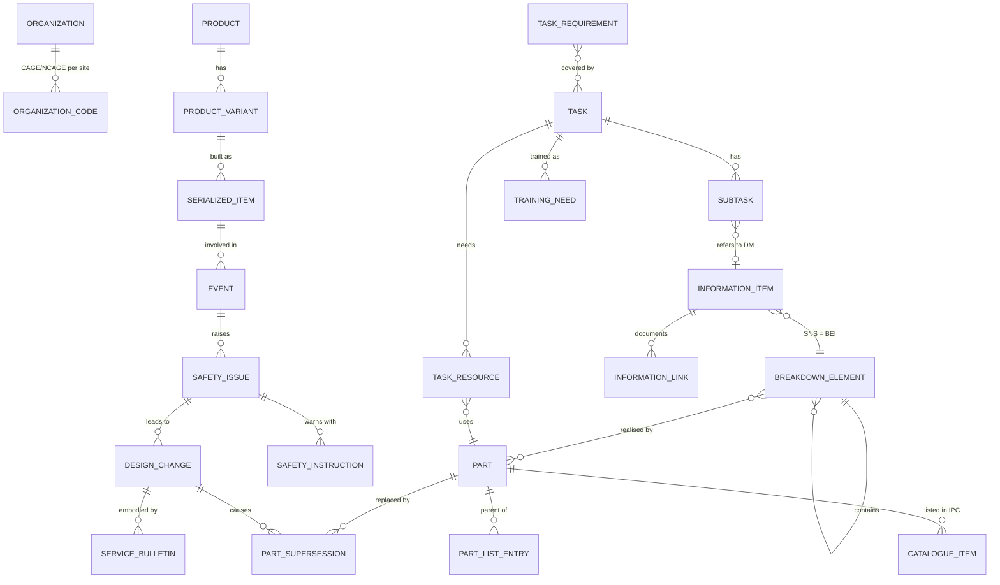

# ASTHRA — Master Knowledge Model (design)

Status: Milestones 5–6. Built so far: identity rules (`asthra/knowledge/identity.py`), issue pairing
(`asthra/knowledge/compat.py`), and **schema v1 with a store** (`asthra/knowledge/schema.sql`,
`asthra/knowledge/store.py`) holding the S-Series Bike example end to end (tests). Importers, the
library panel and filling are next (K1).

## 1. What it is for

Technical data about one product is written several times, in several standards:

| Standard | Holds | Example facts |
|---|---|---|
| **S1000D** | technical publications (data modules) | procedures, descriptions, IPD (illustrated parts data), warnings, tools and consumables per task |
| **S2000M** | material management / provisioning | parts, part identification, units of issue, quantities per assembly, catalogue sequence numbers, spares data |
| **S3000L** | logistic support analysis (LSA) | product breakdown, maintenance tasks, task resources (personnel, support equipment, spares, consumables), durations |

Today the same part number, the same quantity or the same task appears in all three, typed by
different people, and they drift apart. The knowledge model is **one store of product facts**
that every standard reads from and writes to:

```
   S1000D procedure / IPD ──import──┐                        ┌──fill──> S3000L task & resources
   S2000M provisioning    ──import──┼──> MASTER KNOWLEDGE ───┼──fill──> S1000D IPD / preliminary requirements
   S3000L LSA data        ──import──┘      MODEL             └──fill──> S2000M part data
                                    (facts + provenance)
```

When an S3000L author needs "the support equipment for task 29-10-00-01", ASTHRA offers what the
S1000D procedure and S2000M data already say, with where each value came from, and fills the
S3000L elements with it. Nothing is filled silently: the author sees and accepts the values.

## 2. Principles

1. **Standard-neutral core.** The model stores *product facts* (a part, a task, a quantity), not
   XML elements. Each standard is a view onto those facts.
2. **Every fact has provenance.** Document, element path, line, schema package and issue, date of
   import. A value without a source is never used to fill a document.
3. **Nothing is overwritten silently.** Two sources that disagree are both kept and shown as a
   conflict; a rule (or the user) decides which is authoritative.
4. **Applicability and versions are first-class.** Facts carry the product configuration they
   apply to and the source issue they came from.
5. **Mappings are data, not code.** "S1000D `supportEquipDescr/identNumber/partAndSerialNumber/partNumber`
   ↔ core `Part.partNumber`" is written in a mapping file that can be reviewed, versioned and
   extended per project, without changing ASTHRA.
6. **Deterministic first.** Import, identity matching and filling are rule-based and explainable.
   Any AI assistance (for example suggesting a match for an unidentified part) is optional,
   marked as a suggestion, and never writes by itself.
7. **Generated output is validated.** Every document ASTHRA fills or generates goes through the
   same schema validation (and later BREX) as a hand-written one.

## 3. Aligning with the S-Series: SX000i and its family

The S-Series specifications already define how their data fits together. ASTHRA's core model
follows that work instead of inventing its own vocabulary. (Verify the details below against
the issues you hold; titles and numbering are as published by the S-Series steering committees.)

| Specification | Role | How ASTHRA uses it |
|---|---|---|
| **SX000i** — International guide for the use of the S-Series of Integrated Product Support (IPS) specifications | the umbrella: the IPS process, how the specifications work together, common terms | the overall picture of which specification owns which data, and the process order (LSA → provisioning → publications) |
| **SX001G** — Glossary for the S-Series | common definitions | names and definitions of core classes and attributes; shown as help text in ASTHRA |
| **SX002D** — Common data model for the S-Series | the classes shared by the S-Series data models (e.g. product, breakdown elements, parts, organizations, applicability, documents, remarks) | **the backbone of the core model**: class and attribute names follow SX002D where it defines them |
| **SX003X** — Interoperability matrix | which data is exchanged between which specifications | source for the **mapping files** (section 6) |
| **SX004G** — UML model reader's guide / **SX005G** — XML schema implementation guidance | how the data models are drawn and turned into XML schemas | how ASTHRA reads S2000M/S3000L schemas generated from those models |

Practical consequences:

- **S2000M and S3000L** (and S4000P, S5000F, S6000T) are *data-model* specifications built on the
  common model. Their XML is close to the core model; importing and filling them is largely a
  one-to-one mapping of classes.
- **S1000D** is *document*-based. Its data modules carry facts inside prose and structure
  (a procedure's preliminary requirements, an IPD's catalogue items). Import extracts facts from
  well-defined places; filling writes into those places. Free text is linked, not parsed.
- ASTHRA implements the **subset** of the common model needed for S1000D, S2000M and S3000L first,
  and records for each class which SX002D issue it follows, so later issues can be mapped.

## 4. The core model

### 4.1 Entities

| Entity | Identity (how two records are known to be the same) | Main attributes | Typical sources |
|---|---|---|---|
| **Product / ProductVariant** | model identification code (+ variant) | name, variants, serial ranges | S1000D `modelIdentCode`, S3000L product, S2000M |
| **BreakdownElement** | breakdown type + code (SNS code, LSA control number / LCN, zone, access) | name, parent, type (physical, functional, zonal) | S3000L breakdown, S1000D SNS in the DMC, S2000M |
| **Part** | manufacturer code (CAGE/NCAGE) + part number; also NSN | name, short name, unit of issue, material, supersession | S2000M part data, S1000D IPD, S1000D identNumber |
| **PartUsage** | assembly part/breakdown + position (figure/item, CSN) | quantity per next higher assembly, applicability, remarks | S1000D IPD catalogue items, S2000M CSN |
| **Task** | task code (S3000L), or S1000D DMC + procedure | title, type (inspection, removal…), interval, duration, skill level | S3000L tasks, S1000D procedures |
| **TaskStep** | task + sequence | text (linked to source), warnings/cautions/notes | S1000D procedural steps, S3000L subtasks |
| **ResourceRequirement** | task + resource + role | kind (support equipment, supply/consumable, spare, personnel), quantity, unit | S1000D preliminary requirements, S3000L task resources |
| **InformationItem** | S1000D DMC + issue (or other document id) | title, info code, issue, date, status | S1000D identAndStatusSection |
| **Figure / ICN** | ICN | title, sheets, hotspots | S1000D figures, IPD |
| **Applicability** | expression over product attributes/conditions | display text, assertions | S1000D applic/ACT/CCT, S3000L/S2000M applicability |
| **Organization** | enterprise code (CAGE) | name, role | S1000D responsiblePartnerCompany/originator, S2000M |
| **Warning / Caution** | text + id (S1000D warning repository) | text, applicability | S1000D warnings/cautions (and repository DMs) |
| **Quantity / Unit** | — (value objects) | value, unit of measure, tolerance | everywhere |

### 4.2 Relations (a graph)

`Product ─has→ BreakdownElement ─contains→ BreakdownElement`,
`BreakdownElement ─realizedBy→ Part`, `Part ─usedIn(PartUsage)→ Part`,
`Task ─appliesTo→ BreakdownElement`, `Task ─has→ TaskStep`, `Task ─requires(ResourceRequirement)→ Part/Skill`,
`InformationItem ─documents→ Task | BreakdownElement | Part`, `Figure ─illustrates→ PartUsage`,
`* ─applicableTo→ Applicability`.

### 4.3 Facts and provenance

Every attribute value and every relation is a **fact**:

```
fact: (entity, attribute, value, unit?, applicability?, source_id, confidence=exact|mapped|suggested, status=active|superseded|conflict)
source: (document id, file hash, schema package + issue, element path, line, imported_at, by)
```

Several facts for the same attribute are normal (different sources, versions, applicability).
The **current value** is chosen by a rule (section 7), never by "last import wins".

### 4.4 Storage

- **SQLite** (already used by ASTHRA), in the project's data folder: tables `entity`, `fact`,
  `relation`, `source`, `mapping_run`, `conflict`. Indexed by identity keys.
- **NetworkX** in memory for graph questions (what uses this part; which tasks need this tool;
  what changes if this part is superseded).
- Export of the whole model as JSON-LD or plain JSON for review and backup; no proprietary format.

## 5. Importers (standard → core)

Each importer reads a **validated** document (it refuses documents with structural errors) and
emits facts with provenance. Examples:

| Source | Extracted | Into |
|---|---|---|
| S1000D `identAndStatusSection` | DMC, issue, title, applicability, responsible company | InformationItem, Applicability, Organization |
| S1000D procedure `preliminaryRqmts` | `supportEquipDescr`, `supplyDescr`, `spareDescr` (name, identNumber, quantity, unit), personnel, estimated time, safety | ResourceRequirement → Part; Warning |
| S1000D procedure `mainProcedure` | steps (sequence, text reference, warnings) | TaskStep (text linked, not re-authored) |
| S1000D IPD `catalogSeqNumber` / `itemSeqNumber` | figure/item, part identification, quantity per assembly, applicability, NSN | Part, PartUsage, Figure |
| S2000M part data / CSN data | part identification, units of issue, quantities, CSN, supersession | Part, PartUsage |
| S3000L breakdown, tasks, resources | LCN tree, tasks, intervals, durations, resources | BreakdownElement, Task, ResourceRequirement |

Identity matching is by the keys in 4.1. A record that matches nothing becomes a new entity;
a record that matches two becomes a **conflict to resolve**, never a guess.

### 5.1 Built (m4.7): four kinds of source, one set of facts

| Source | Importer | Facts |
|---|---|---|
| S1000D data module | `knowledge/s1000d_import.py` | identity, personnel, tools / supplies / spares, warnings, references, IPD lines (with `usableOnCodeAssy`) |
| ATA iSpec 2200 manual (SGML via OpenSP, or XML) | `knowledge/ata_import.py` | manual and TASK identities, `<ted>` tools and `<con>` consumables per task, warnings and cautions, IPL lines, vendors, service bulletins |
| S2000M provisioning (ASTHRA test schema) | `knowledge/s2000m_import.py` | parts (unit of issue), parts-list lines with effectivity |
| Engineering BOM (CSV, Excel, JSON) | `knowledge/engineering.py` | parts, parent-child structure (`part_list_entry`), BOM lines as written (`bom_line`), engineering attributes such as mass, material, CAD file (`part_property`) |

"Add project to library" reads every document of the project that is one of the first three (identified by
schema or by its top element; documents whose structure failed are skipped; documents no installed schema covers
are read and marked "not validated"). The engineering BOM is imported from the Knowledge screen. BOM columns are
recognised by name (Part Number / P/N, CAGE, Description, Qty, UoM, Level, Find No, Parent, Effectivity, Item type,
Make/Buy); every other column becomes a part property. A JSON file uses the `asthra-engineering/1` format
(documented in `engineering.py`) or a plain list of objects with the same names.

**Conventions** so the sources compare: ATA item `50A` = S1000D item `050` + variant `A` = S2000M `050A`;
ATA indent 0/1/2 = indenture 1/2/3; `RF` = quantity 1; ATA vendor code `V` + CAGE = CAGE.

**Cross-source checks** (`knowledge/crosscheck.py`, shown under Findings): two parts lists sharing a top-level part
number are compared item by item (part number, CAGE, quantity, indenture, effectivity, missing items); the engineering
BOM is compared with the structure the parts lists imply (quantity, part in one and not the other); a part number
without a CAGE that matches exactly one part with a CAGE is reported as a suggested match, never merged.

Test data: `backend/tests/fixtures/knowledge/ra7100` — one product in all four forms, consistent, plus planted
disagreements in `tests/test_knowledge_crosssource.py`.

### 5.2 Built (m4.8): 3D models and the STEP ↔ MBOM reconciliation

| Input | Where | What ASTHRA keeps |
|---|---|---|
| Reconciliation result (JSON from the STEP→GLB / MBOM tool: `matched`, `unmatched_step`, `unmatched_mbom`) | Knowledge → Import engineering data… | MBOM lines (part numbers without their level dots, level, quantity), one `cad_link` per 3D item (3D name, quantity, status, confidence, the tool's flags), the tool's findings: quantity differs, matched with doubt, which BOM line (candidates), 3D item not in the MBOM, MBOM lines not modelled |
| 3D model (GLB) | Knowledge → 3D models → Add 3D model | the file in the data folder (`knowledge/models`), its node names (`cad_node`) |

A node shows a part when its name is the part number, or the 3D name the reconciliation linked to the part,
optionally followed by an instance suffix (`_1`, `.001`, `:2`, `(3)`), or contains it as a whole token
(`F6137-C75930` shows `C75930`); see `knowledge/models.py`.

Where the 3D model appears:
- **Knowledge → 3D models**: the whole model coloured by status (matched, matched with doubt, quantity differs,
  not in the BOM, part number in the library); click a part to see and open it.
- **Knowledge → Parts → a part**: the part highlighted in its model, with its 3D items and their status.
- **Document view (any standard)**: select a part number, an IPL / IPD line, a tool or a part record; the
  inspector shows that part highlighted in the model.

## 6. Mappings and filling (core → standard)

A **mapping file** per standard issue describes, for each target place, where the value comes from:

```yaml
# mappings/s3000l-2.0/task-resources.yaml (illustrative)
target: S3000L 2.0 / taskRequirement / supportEquipmentRequirement
for_each: Task.requires[kind = support-equipment]
fields:
  partIdentifier.partNumber:        Part.partNumber
  partIdentifier.manufacturerCode:  Part.manufacturerCode
  quantity:                          ResourceRequirement.quantity
  quantity/@unit:                    ResourceRequirement.unit
required: [partNumber, manufacturerCode]
on_missing: ask            # ask | leave-empty-and-report | skip
```

Filling works in two ways:

1. **In the editor** — when an author inserts, say, a `supportEquipDescr` in an S1000D procedure,
   or an S3000L support-equipment requirement, the insert panel offers matching library entries
   ("Torque wrench TW-100, CAGE 12345 — from DMC-…-520A, IPD fig 3 item 12"). Choosing one fills
   the content fields; the provenance is recorded. This extends the content prompts that exist today.
2. **Generation** — "Create S3000L task resources from this S1000D procedure", "Create an IPD
   skeleton from S2000M data": ASTHRA builds the target XML from the mapping, validates it against
   the installed schema, and lists every value it could not fill (`on_missing`), instead of
   inventing it.

Every generated element keeps a link to the facts it came from (an ASTHRA sidecar record, not
markup inside the standard's XML), so a later re-import can show what changed.

## 7. Conflicts, versions, applicability

- **Authority rules** per attribute, configurable per project, e.g. "part identification:
  S2000M is authoritative; S1000D IPD must agree", "task duration: S3000L". When sources disagree,
  ASTHRA shows both values, their sources, and the rule's choice; the author can accept or override
  (the override is itself recorded).
- **Consistency checks** become a validation stage ("References / consistency" in the status panel):
  "IPD fig 3 item 12 quantity 2, S2000M says 3", "procedure DMC-…-520A uses TW-100, which S2000M
  marks superseded by TW-110".
- **Versions**: facts from an older issue of a document are marked superseded when the newer issue
  is imported; history stays queryable.
- **Applicability**: facts keep their applicability; filling a document for a given configuration
  uses only facts that apply to it.

## 8. What the user will see

- **Library** panel: products, breakdown, parts, tasks — searchable, each with its sources.
- **Insert with library** in the editor (section 6.1).
- **Generate** wizards per standard pair (section 6.2), with a fill report.
- **Consistency** results in the status panel, with links to both sources.
- **Import** from a project: "Add these documents to the library" (validated documents only).

## 9. Phased plan

| Phase | Scope | Proof it works |
|---|---|---|
| **K0** ✓ | identity rules (CAGE/NCAGE, part key, NSN, CSN, typed breakdown identifiers) and issue pairing | unit tests |
| **K0b** ✓ | schema v1 + store; the Bike example loaded end to end; impact analysis, procedure requirements from the MTA, consistency rules | tests on the Bike example |
| **K1** ✓ (first part) | shared library in the data folder; S1000D importer (identity, BEI, personnel, resources, warnings, references, IPD); **Knowledge screen** (overview, breakdown, parts with impact, tasks with derived procedure, data modules, findings, sources); **insert from library** in the editor | tests + browser test with the Bike example and the samples |
| **K1** (remaining) | core store (SQLite + graph), S1000D importers (identification, procedure preliminary requirements, IPD), library panel, "insert from library" for support equipment / supplies / spares | benchmark: import the Bike data set; every part and tool found with correct provenance; re-import idempotent |
| **K2** | S2000M importer; S1000D IPD ↔ S2000M consistency checks; authority rules | planted-inconsistency suite (quantity, supersession, identification) detected, no false positives on a consistent set |
| **K3** | S3000L importer and filler; S3000L task resources ↔ S1000D preliminary requirements; generation with fill report | generated S3000L validates against the official schema; every unfilled value listed |
| **K4** | SX002D alignment review, further S-Series (S4000P, S5000F, S6000T), mapping files per issue | mapping files reviewed against SX003X for the issues in use |

Each phase gets a benchmark suite like the validation benchmark, so "it works" is measured.

## 9b. What the S-Series Bike example (UF2024) confirms

The S-Series User Forum 2024 "End-to-end IPS Business Process — BIKE example" runs one product
(Yeti SB5 Beti mountain bike) through SX000i, S1000D, S2000M, S3000L, S4000P, S5000F and S6000T,
including an accident, a design change and the post-mod update of every deliverable. Lessons taken
into schema v1:

1. **SX000i carries programme data**: project, contracts, WBS/OBS/CBS, planning; organisations with
   roles (manufacturer, licensee, operator, owner, customer) and persons; support and maintenance
   concept (maintenance levels ML1–ML4), sites, trades and competence levels, operational scenarios
   (hours/year), fleets.
2. **The Breakdown Element Identifier (BEI) is the common key** of S3000L, S2000M and S1000D:
   `B5-A-A7-31-02-00A`. The IPC cross-references it; an S1000D DMC is BEI + information code + item
   location (`B5-A-A7-31-02-00A-520A-D`); IPD DMs replace the disassembly code by figure number +
   variant (`B5-A-A7-31-00-010-941A-D`).
3. **S3000L**: breakdown elements (revision, type, realising part, LSA candidate full/partial/none
   with justification) → parts and parts lists (parent part, quantity) → task requirements
   (S4000P PMTR, FMECA, damage, special event) → tasks (type, maintenance level, spares, consumables,
   support equipment, conditions) → subtasks (skill, trade, persons, labour time, duration, and the
   **data module each subtask refers to**).
4. **S1000D procedures are generated from the MTA**: preliminary requirements = task resources and
   personnel; steps = subtasks with references to other DMs; schedule DMs (SNS 05) from S4000P PMTRs.
5. **S2000M IPC lines**: item, indenture, part number, NCAGE (manufacturer and suppliers, standard
   parts), QNA, usable-on code, SMR code (PAOOF, PAOZZ, PAODD), unit of issue, BEI reference; ICNs
   include the originator's NCAGE.
6. **In service (S5000F / SX000i)**: events (severity, usage phase, serialised item, related events),
   damages, operational periods, logbook entries with operating counters, safety issue → safety
   warning/instruction with required actions → design change → change embodiment / technical order →
   service bulletin; part supersession pre-mod → post-mod flows back into LSA, IPC, DMs and training.
7. **Cross-checks find real issues even in the example**: task T00002 is ML1 in the LSA table but
   ML2 in its data module; its subtask durations total 19 min against 25 min in the DM. Schema v1's
   consistency rules report both.



Every row also carries `source_id` (provenance) and `layer` (shared library or organisation overlay).

## 10. Decisions (agreed) and findings

### 10.1 Which issues work together — chosen from what is installed

- The S-Series other than S1000D is published in coordinated **block releases**. The **S-Series 2021
  block release** comprises **S2000M Issue 7.0, S3000L Issue 2.0, SX002D Issue 2.1** (with SX000i,
  SX001G, S4000P, S5000F, S6000T). S1000D follows its own release cycle.
- ASTHRA picks the counterpart issue **automatically only when unambiguous**
  (`asthra/knowledge/compat.py`, built):
  1. a **project rule** pairs them (e.g. "Project X: S1000D 6 with S3000L 1.1"),
  2. else the **block release** pairs them and that issue is installed,
  3. else **exactly one** issue of the target standard is installed — used, with a note to confirm
     compatibility (S1000D ↔ S2000M/S3000L pairings are not in a block release),
  4. else the **user chooses** from the installed issues (the document's own content is shown).
- Documents already declare their issue (schema location / namespace), so the source side is
  always known.

### 10.2 Authority for part data

- **PLM and the IPD are authoritative** for part data; **S2000M and the other sources confirm**.
  Default authority rules: part identification, description and structure (BOM) → PLM, then IPD;
  provisioning data (units of issue, spares) → S2000M; differences are reported as consistency
  findings, never merged silently.
- PLM data comes in through a **BOM export** first (CSV/XLSX with a column mapping, then PLMXML or
  STEP AP242 when available), since PLM systems differ and a direct connection is project-specific.

### 10.3 Identity conventions (research findings → rules, built in `asthra/knowledge/identity.py`)

| Identifier | Finding | ASTHRA rule |
|---|---|---|
| **CAGE / NCAGE** | 5 characters; US codes start with a digit; non-US suppliers receive an NCAGE through the NATO Codification System (French codes start with F or M); a code identifies a **facility (site)**, not a company | part key = CAGE + part number; syntax checked; an organisation can own several codes (e.g. each Safran site); a part number **without** a code is "unqualified" — offered as a possible match, never merged automatically |
| **Part number** | issued by the manufacturer; punctuation significant | compared trimmed, without spaces, upper case; dashes/slashes kept |
| **NSN** | 4-digit supply class + 9-character NIIN (first 2 = country code) | secondary identifier: confirms a match, does not create one |
| **CSN** | the item's address in the illustrated parts catalogue: SNS + figure + figure variant + item + item variant; 13 characters (6-character SNS) in older S2000M issues, 16 characters (9-character "extended" SNS) from S2000M Issue 4.0; S1000D 4.x+ splits it into attributes of `catalogSeqNumber` | stored structured; written as the 13/16-character S2000M string when needed |
| **Breakdown identifiers** | S3000L identifies breakdown elements by *typed* identifiers (identifier + classifier + set by), based on ISO 10303-239 (PLCS); the classical LCN assignment rules come from MIL-STD-1388-2B / GEIA-STD-0007 | typed identifiers: `SNS:25-30-12`, `ATA:25-26-62`, `LCN:…@company`; civil-aircraft SNS and iSpec 2200 manuals share ATA chapters, so an S1000D DM and a CMM for the same equipment are linked through the ATA chapter/section |

When the project's own conventions are confirmed (e.g. an LCN format), they are added as project
rules; nothing above hard-codes a customer format.

### 10.4 Library scope — shared, with organisation overlays

- **One shared library per product family**, across projects.
- **Organisation overlays** on top (for example Safran Electrical & Power, Safran Seats, Safran
  Landing Systems, or a specific customer): their own authority rules, CAGE codes, naming and BREX,
  and customer-specific values. An overlay adds or overrides facts **for its scope only**; shared
  facts are never edited by an overlay, and every value shows which layer it came from.

```
Shared library (product family)  ←  facts from PLM, IPD, S2000M, S3000L, S1000D
   └─ Organisation overlay (e.g. a Safran company)  ←  its rules, codes, customer-specific values
        └─ Project                                  ←  documents being written
```

### 10.5 Test data

- S1000D: the Issue 4.1 **Bike data set** (available).
- S2000M / S3000L: bike-style sample data sets to be obtained; each phase's benchmark uses them.
